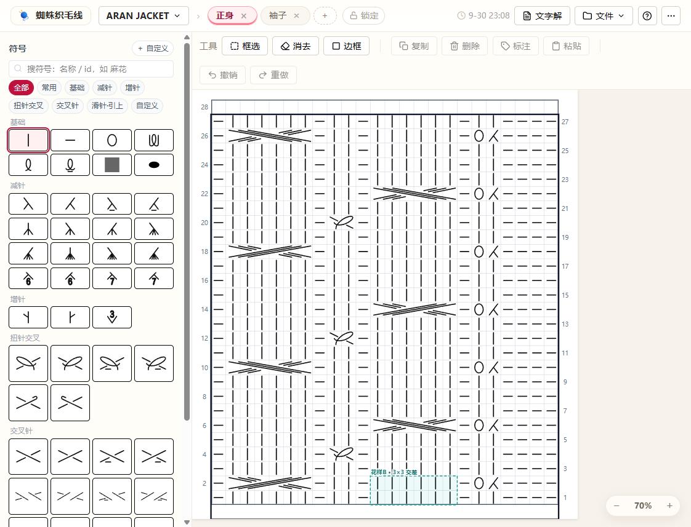
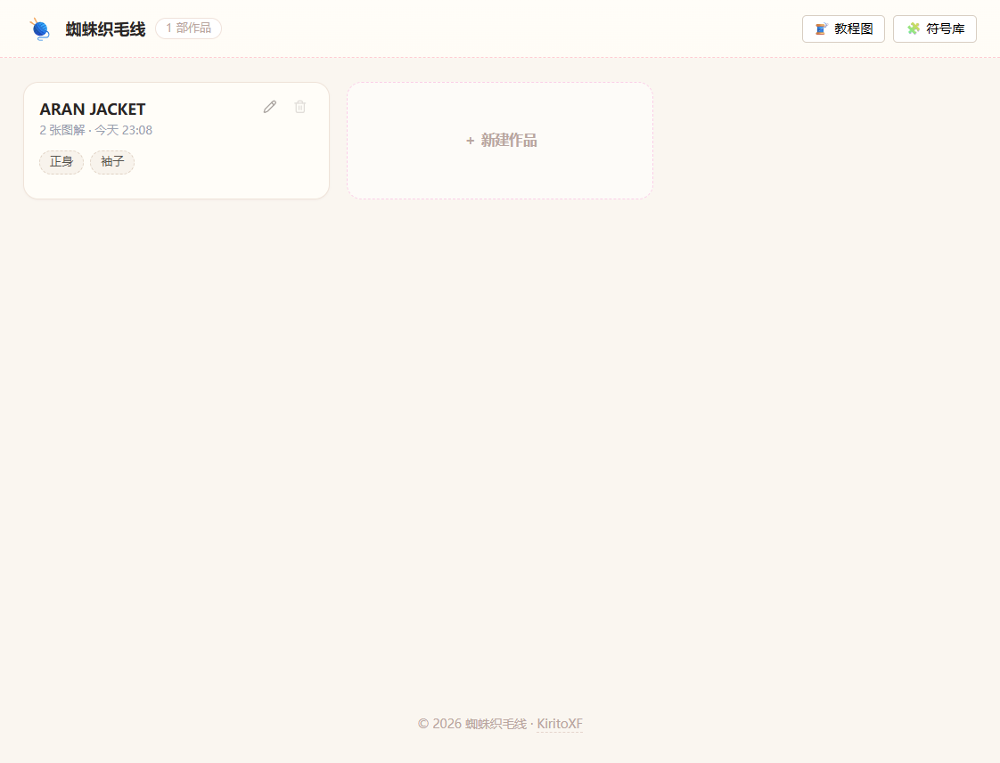
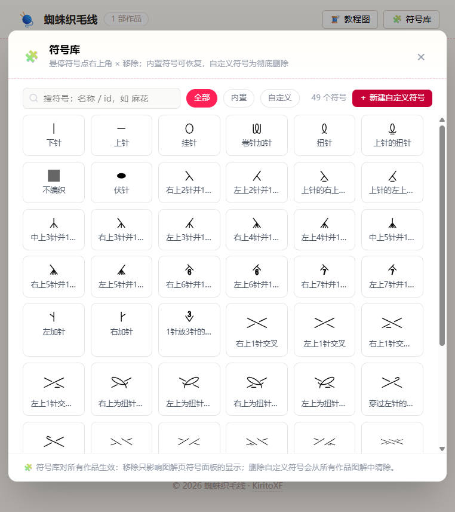
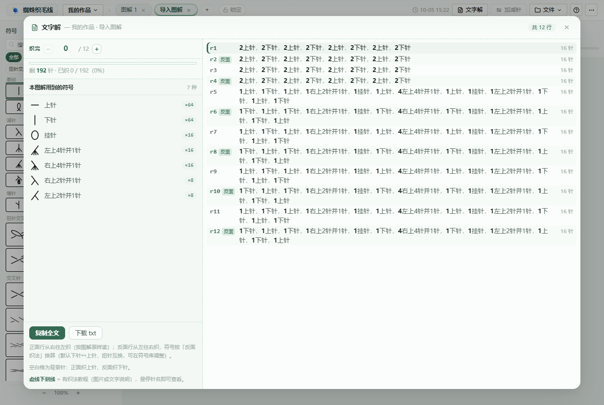
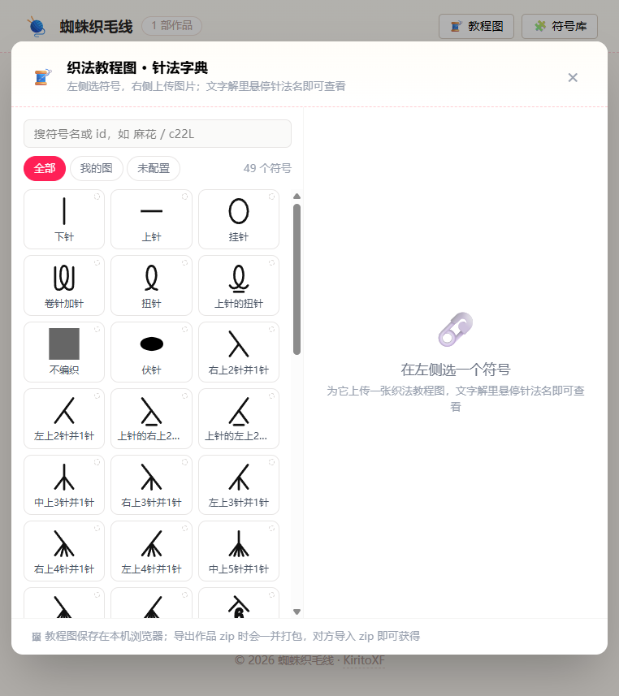
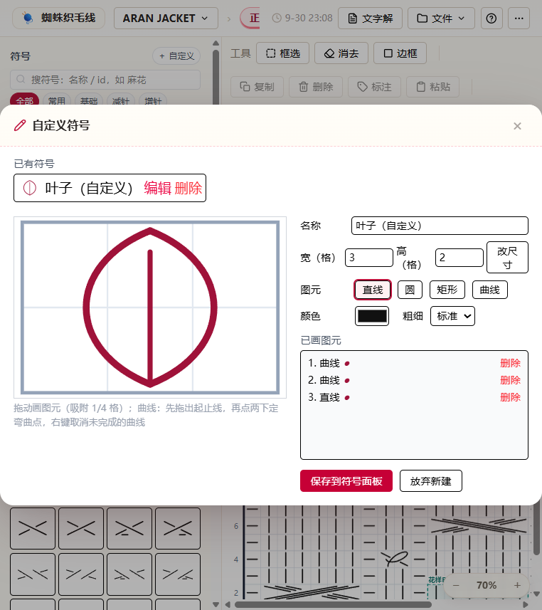
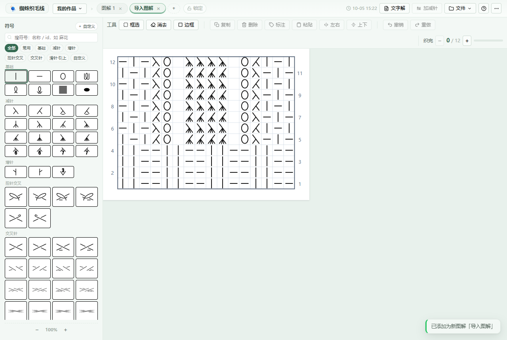

# 蜘蛛织毛线

[English](README.md) | 简体中文

纯前端的棒针编织图解编辑器：画格子、摆符号、框选复制、区域标注、图解转文字解，还能给每个针法配上织法教程（图片或文字说明），存档与导出一条龙。构建产物是单个自包含 HTML，双击即可离线使用，无需联网。



## 功能特性

### 作品与图解管理



- 作品 / 图解两级结构：一个作品下可建多个图解（如正身、袖子、领口）
- 首页（作品管理页）：卡片式浏览，显示图解数量与最近编辑时间；点卡片进作品，点图解 chip 直达该图解；卡片上可直接重命名 / 删除；网格最后一张卡片即"＋ 新建作品"；页脚是版权与项目地址
- 图解页签栏：单击切换、双击行内重命名、删除、新建（自动命名"图解 N"）
- 图解锁定：页签栏"锁定"按钮一键锁定当前图解，锁定后所有编辑操作（放置/擦除/粘贴/标注/网格调整/撤销重做）被拦截，防止完成的图解被误改；页签上显示锁标，锁定状态随存档保存
- 最后更改时间：常驻顶栏右侧显示当前图解的保存时间。图面操作（放置/擦除/边框/标注/列号/网格/撤销重做）计时；锁定/解锁、重命名、收藏等非内容操作不计时；时间随存档保存
- 主题：四套手选配色（苔绿 / 玫红 / 雾霾蓝 / 灰玫瑰），顶栏「更多」菜单切换，选择记忆在本机

### 画布

- 网格最大 200 × 200 格（针数 × 行数），缩放 0.5 – 2.5
- 第 1 行起始侧可切换：右侧（从右往左织）/ 左侧（从左往右织）
- 手动列号标注、行高亮
- 符号层 canvas 位图渲染（零 DOM 节点）：大图解（如 40 行 × 117 列、3200+ 符号）切换与编辑依然流畅

### 符号



- 内置 JIS 标准棒针符号，以及本项目自建符号（如 3×3 交差）
- 分类过滤（多选 toggle）、按名称 / id 搜索
- "常用"收藏（符号左上角悬停星标）
- 首页「🧩 符号库」统一管理符号：左侧符号字典（搜索 + 全部 / 内置 / 自定义 / 我配置的 / 未配置 / 已移除 筛选），右侧按符号配置详情——
  - **内置符号**：仅从图解页符号面板隐藏，定义保留、图上已放置的不受影响，可在「已移除」筛选下随时恢复
  - **自定义符号**：彻底删除（二次确认），并自动清理所有作品图解中对该符号的引用
- 符号库也能「＋ 新建」自定义符号直接开工（见下）

### 编辑工具

- 框选：拖出矩形区域，配合复制 / 删除 / 标注 / 粘贴使用
- 边框：拖选画花样外框
- 消去：点击或拖动删除符号与边框
- 标注：给框选区域加文字（如"花样A · 12针重复"），青色虚线框显示在区域上方
- 复制 / 粘贴：以复制块左下角对齐所点击的格
- 撤销 / 重做，图面操作均进历史

### 文字解



- 顶栏"文字解"一键把当前图解转成逐行文字解，宽弹窗左右分栏：
  - **左栏**：本图解用到的符号速查（缩略图 + 名称 + 使用次数，按次数降序，配了教程（图或文字）的带虚线下划线）、复制全文 / 下载 txt、使用提示
  - **右栏**：逐行正文，行号 + 反面徽标 + 行末针数
- 悬停针法名称可弹出其织法教程——图片、文字说明或两者同时展示，点击图片查看原图
- 正反面按第 1 行起始侧自动推算（与画布行号位置一致）：正面行右→左原样读，反面行左→右读并自动转换（下针↔上针、扭针→上针的扭针等）
- 空白格按背景针处理（正面行上针、反面行下针）；连续同名针目合并计数；行前缀 `r3：`，反面行标注「反面」
- 文件名 `作品名_图解名.txt`

### 织法教程图



- 符号库弹窗选中符号后，右侧「① 织法教程」按符号配置织法图片（上传 / 替换 / 删除）和/或一段文字说明（失焦自动保存，清空即删）；两者相互独立，可任配其一或组合使用
- 教程图与文字说明都存在本机 IndexedDB，不上传、不联网；内置教程资源可放 `public/tutorials/`（当前为空）
- 教程图与文字说明随「存档作品」的 zip 作品包一起打包（文字为 `tutorials/<符号id>.txt`），换台机器导入后自动还原到本机教程库

### 自定义符号编辑器



- 图元：直线、矩形、椭圆、路径、贝塞尔曲线（拖出起止线 → 点两次定弯点）
- 画布尺寸按符号宽高自适应，宽高修改即输即生效
- 入口两处：首页「🧩 符号库 › ＋ 新建」，或图解页符号面板「＋ 自定义」

### 存档与导出

- 存档作品：整个作品打包为 zip（`作品名.zip`），内含 `work.json`（v2 格式，全部图解）与 `tutorials/`（本机教程图与文字说明原样）
- 载入：支持 zip 作品包与 JSON 存档，一律追加不覆盖——作品包导入为新作品，单图解追加为新图解
- 导出图解：仅当前图解为 JSON（`作品名_图解名.json`，v1 兼容格式，可供旧版使用）
- 导出 SVG：矢量图（`作品名_图解名.svg`，内嵌 `<title>`），用于打印 / 分享
- 存档走 File System Access API 弹系统"另存为"框，可覆盖已有文件；旧浏览器自动降级为下载
- 编辑内容自动保存到浏览器 localStorage

### 桌面端（Tauri · Windows）



- 桌面端加载与网页版完全相同的前端构建产物，功能一一对应，全部可离线使用
- 系统托盘：主窗口点 × 隐藏到托盘（歌词浮窗继续可用）；托盘菜单 = 显示主窗口 / 歌词浮窗开关 / 退出，左键点托盘图标直接唤起窗口
- 歌词浮窗（置顶画中画）：切到别的软件也能看当前行、点织完这行；织法教程 popover 由独立透明承载窗贴边显示；浮窗位置尺寸记忆在本机
- 多实例互斥：重复启动直接唤起并聚焦已运行的主窗口，不开第二个
- 自动更新：启动约 15 秒后检查 GitHub Releases（`latest.json`，minisign 签名校验），发现新版本弹应用内确认框，确认后应用内下载安装（passive 模式）并自动重启；拒绝或失败时引导到 [Releases 页](https://github.com/KiritoXF/knit-spider/releases/latest)手动下载
- 安装包（NSIS）与更新清单随 [GitHub Releases](https://github.com/KiritoXF/knit-spider/releases/latest) 发布

## 使用说明

### 快速开始

```bash
npm install
npm run dev-open    # 启动开发服务器并自动打开编辑器页面（入口 /knitting-chart.html）
```

构建发布：

```bash
npm run build       # 先重新生成符号数据，再产出 dist/knitting-chart.html 单文件
```

`dist/knitting-chart.html` 双击（file://）即可使用，可拷贝到任意机器离线运行。

桌面端（Windows）构建：

```bash
npm run tauri:build   # 产出 NSIS 安装包与更新签名文件（需 Rust 工具链）
```

构建前需设置更新签名私钥环境变量（密钥不入库，见 `src-tauri/keys/`）：
`$env:TAURI_SIGNING_PRIVATE_KEY = Get-Content src-tauri/keys/knit-spider.key -Raw`

### 基本操作

1. 首页点"＋ 新建作品"→ 进入作品 → 新建图解，在顶栏 ⋯› 图解设置里设定网格宽（针数）与行数
2. 从左侧符号面板点选符号，在画布上点击格子放置（按住拖动可连续画）
3. 工具栏"框选"拖出区域后：复制 / 删除选区 / 标注；"粘贴"工具点击目标格落位
4. "边框"工具拖选画花样外框；画错用"消去"擦除
5. 顶栏"文件"：载入 zip / JSON、导出图解 JSON、导出 SVG、存档作品 zip
6. 顶栏"文字解"查看逐行织法说明，左栏可复制或下载 txt，悬停针法名看教程（图或文字说明）
7. 首页「🧩 符号库」给针法配教程图 / 文字说明、设置反面织法，或移除 / 删除符号、新建自定义符号
8. 顶栏右上角「?」随时打开操作说明

### 快捷键

| 按键                    | 功能                 |
| --------------------- | ------------------ |
| Ctrl+Z                | 撤销                 |
| Ctrl+Y / Ctrl+Shift+Z | 重做                 |
| Ctrl+C                | 复制选区               |
| Ctrl+V                | 粘贴                 |
| Delete / Backspace    | 删除选区               |
| Esc                   | 取消选区 / 退出粘贴 / 关闭弹窗 |

### 数据与存档格式

- 自动保存键名 `knitChartProto1`（localStorage）
- 作品包 zip：`work.json`（`{version:2, works:[...]}`）+ `tutorials/`（教程图原样 + `<符号id>.txt` 文字说明）
- 教程图与文字说明另存在 IndexedDB（库名 `knitChartTutor`），不写 localStorage
- 自定义符号库与"已移除的内置符号"是**全局**的（不属于单个作品），随存档与撤销历史走；删除自定义符号会清理所有作品的引用
- v1 旧版单图解 JSON 仍可导入
- 旧版扁平 localStorage 数据自动迁移为「我的作品 / 图解 1」

## 开发说明

### 技术栈

- Vue 3（`<script setup>` 组合式 API）
- Vite 7 + vite-plugin-singlefile（单文件产物）
- Tailwind CSS 4（@tailwindcss/vite 插件）
- fflate（zip 作品包打包 / 解包）
- 符号生成管线：fast-xml-parser + svg-path-commander

### 目录结构

```
├─ knitting-chart.html        # 应用入口 HTML
├─ vite.config.js             # 单文件构建配置，入口 knitting-chart.html
├─ scripts/
│  └─ generate-symbols.mjs    # 从外部 JIS 符号库 SVG 提取路径，生成符号数据
├─ local-symbols/             # 本项目自建符号 SVG（源库没有的，如 3×3 交差）
├─ public/tutorials/          # 内置织法教程图（可选，按符号 id 命名）
├─ src-tauri/                 # 桌面端（Tauri 2）：托盘 / 浮窗 / 多实例互斥 / 自动更新
└─ src/
   ├─ main.js                 # 启动入口
   ├─ App.vue                 # 视图切换（home 首页 / editor 编辑器）与全局弹窗挂载
   ├─ ui.js                   # 会话状态（当前视图、弹窗开关、loading、toast、应用内对话框）
   ├─ store.js                # 全部业务状态与操作（reactive 集中管理）
   ├─ util.js                 # 符号渲染共用实现（symbolInnerMarkup / symDataUrl）
   ├─ symbols.js              # 符号定义（含自建符号 dir 字段）
   ├─ symbols.generated.js    # 生成产物，勿手改
   ├─ exportSvg.js            # SVG 导出
   ├─ textChart.js            # 文字解纯转换模块（无 Vue 依赖，node 可直调）
   ├─ updater.js              # 桌面端自动更新（检查 Releases → 应用内下载安装重启）
   ├─ tutorials.js            # 教程取图/取文（本机上传优先 → 内置静态资源）
   ├─ tutorialStore.js        # 教程图与文字说明的 IndexedDB 存储（含 zip 导入导出）
   ├─ selftest.js             # 页面自测脚本
   ├─ style.css
   └─ components/
      ├─ HomeView.vue         # 首页：作品管理 + 教程图 / 符号库入口
      ├─ TopBar.vue           # 顶栏：回首页、切换作品、图解页签、最后更改、文字解、文件、帮助、更多
      ├─ ChartTabs.vue        # 图解页签（切换 / 重命名 / 锁定 / 删除 / 新建）
      ├─ ChartSettings.vue    # 图解设置（网格尺寸 / 行向 / 列号）
      ├─ ToolBar.vue          # 工具栏与全局快捷键
      ├─ ChartCanvas.vue      # 画布：canvas 符号层 + 边框/标注/框选渲染与交互
      ├─ ZoomControl.vue      # 缩放控件
      ├─ PalettePanel.vue     # 符号面板（搜索 / 分类 / 收藏）
      ├─ SymbolArt.vue        # 单符号渲染组件
      ├─ SymbolCenterModal.vue # 符号库弹窗（符号字典 + 教程图 / 文字说明 + 反面织法 + 移除 / 恢复）
      ├─ TextChartModal.vue   # 文字解弹窗（符号速查 + 正文 + 教程图 popover）
      ├─ HelpModal.vue        # 操作说明
      ├─ AppDialog.vue        # 应用内确认 / 输入对话框
      └─ EditorModal.vue      # 自定义符号编辑器
```

### 符号生成管线

```bash
npm run gen-symbols   # 单独重新生成 src/symbols.generated.js
```

- 外部 JIS 符号库路径在 `scripts/generate-symbols.mjs` 中配置
- 自建符号放 `local-symbols/*.svg`，与库符号走同一转换管线
- 注意：`npm run build` 会先自动跑 gen-symbols；但单跑 gen-symbols 不会更新 dist，仍需重新 build

### 开发约定（踩坑备忘）

- store.js 的操作函数保持同步（供自测直调）；UI 入口用 `ui.js` 的 `withLoading(fn)` 包裹——大图解切换会触发画布重渲染，需先出 loading 遮罩
- 画布符号层是 canvas 位图（`#chartWrap` 夹心结构：底 SVG 热区/高亮/行号 < `#symCanvas` 网格+符号位图 < 顶 SVG 边框/标注/框选）；每符号经 `symDataUrl` 生成 data-URL 位图缓存（WeakMap 按符号对象弱引用），重绘只做 drawImage 贴图。勿改回 SVG 节点渲染（v-html 内联路径在大图解有 8-10s 长任务；`<defs>+<use>` 去重 Chrome 更慢，均已实测踩坑）
- 撤销历史挂在 `save()` 上做图面内容指纹去重，快照存 JSON 字符串（恢复时才 parse）；zoom / tool / highlight 等会话状态不进历史；undo/redo 后必须调 `syncHistUI()`
- 框选拖拽结束必须置 `skipClick` 标记跳过浏览器补发的 click 事件，否则选区会被重置为单格
- `persistObject` 只做一次 JSON.stringify，禁止内部再深拷贝；作品树数组被整体替换后须 `projectActive()` 重新对准投影
- `.modal-shell { overflow: hidden }` 是**无 layer 的普通 CSS**，优先级高于 Tailwind 在 `@layer utilities` 里的 `overflow-auto`。需要滚动的弹窗必须写自定义 flex column 外壳 + 内部 `overflow-y:auto; min-height:0` 的滚动体（参见 `.tcm-shell` / `.help-shell`）
- 首页作品网格 `.home-grid` 用 `align-content: start`，页脚吸底交给 `.home-foot` 的 `margin-top:auto`（给网格 `flex:1 0 auto` 会把卡片拉高）
- 悬停才出现的角标（如 `.sym-remove`）要放在卡片**内部**，放在卡片外沿会被滚动容器的 `overflow` 裁掉一角
- 自测 `runSelfTest`：开头切到 editor 视图再 tick（否则画布 DOM 不存在），结尾 `save()` 落盘干净状态；符号层断言走像素采样（`window.__symLayer` 钩子 + `blockHasInk`）

